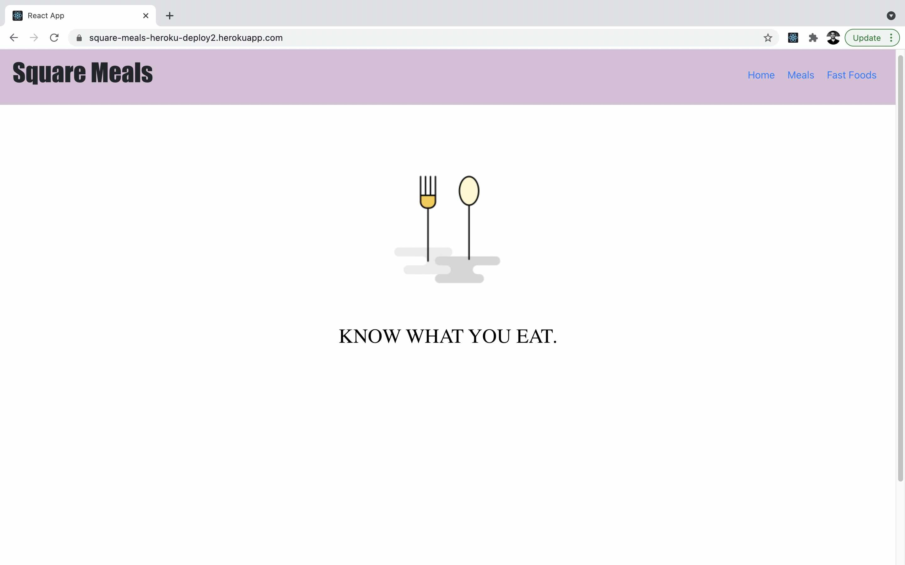
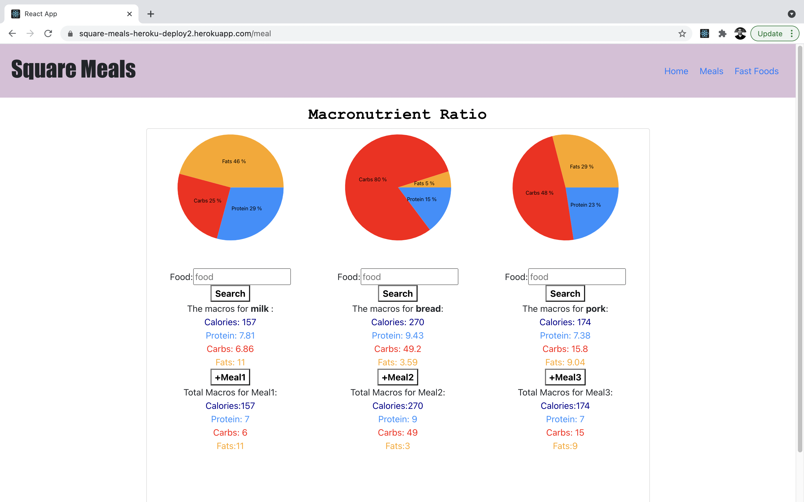
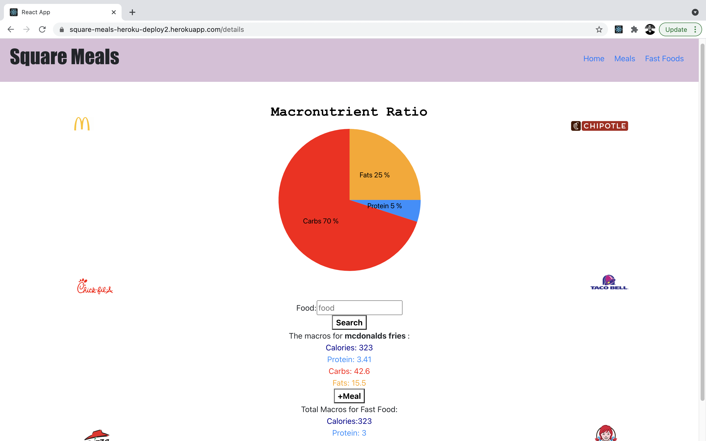
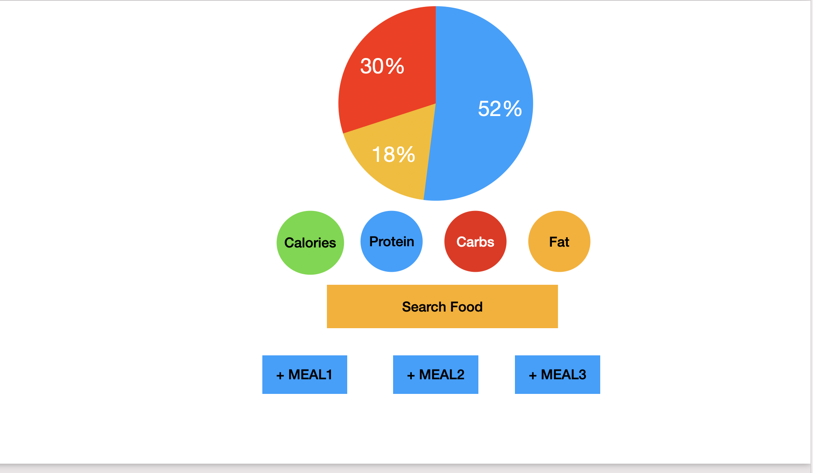
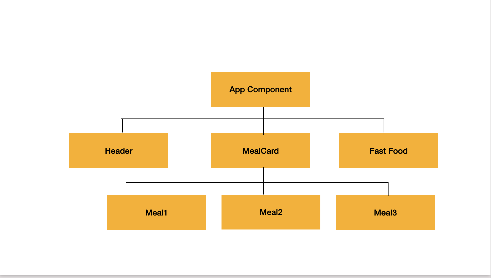

#GA-SEI-Project-Square Meals

###Welcome

Welcome to Square Meals App. It's a nutrition app that gives you macro nutrition data for the square meals of the day. And not just nutrition data of the three important meals of the day but it also provides macro nutrition data of some of the most popular fast food restaurant chains.

### Technologies Used

- JavaScript
- React
- React Routers
- Third-party API : FDC API - USDA
- React Bootstrap
- React minimal pie chart
- Flexbox
- Heroku

### Installation Instructions

- Use chrome browser for accessing the app.
- The app is available on heroku and can be accessed from the following link:
  https://square-meals-heroku-deploy2.herokuapp.com/

### User Stories

- As a user , I would like to search individual food and add get the info on calories and macro nutirents.
- As user, I would like to add each food item into separate meals.
- As a user, I would like to see each meal's calorie count and macro nutrients.
- As a user, I would like to see each day's total calorie and macro nutrient intake.

### Wireframes

### React Components

